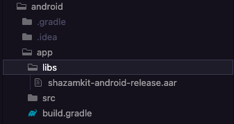
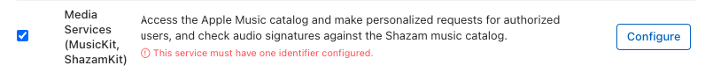
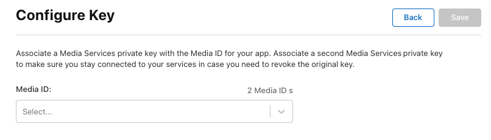
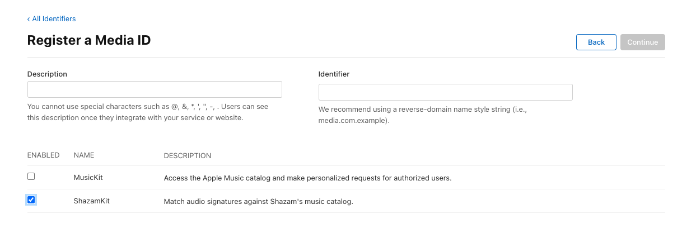

# Flutter Shazam Kit


A plugin that helps you detect songs through your device's microphone

Note: This plugin depends on Apple's ShazamKit, requires IOS 15 or higher, and requires Android API level 23 (Android 6.0) or higher.

## Configuration

### Android configuration

1. Add [android.permission.RECORD_AUDIO](https://developer.android.com/reference/android/Manifest.permission#RECORD_AUDIO) permission to your `AndroidManifest.xml`.

```xml
<uses-permission android:name="android.permission.RECORD_AUDIO" />
```

2. Go to this [Download Page](https://developer.apple.com/download/all/?q=Android%20ShazamKit) and download the latest version of ShazamKit for Android, once you have downloaded it, create a new folder called `libs` inside your android’s `app` folder and place the `.aar` file inside that `libs` folder.

Your android project’s structure should look like this:



3. Inside your app-level `build.gradle`, change `minSdkVersion` to 23 and sync your project again.

```groovy
minSdkVersion 23
```

4. In order to use `ShazamCatalog` on Android, you need to have an Apple Developer Token to access ShazamKit service provided by Apple, please follow this [link](https://help.apple.com/developer-account/#/deva27624586) for more details.
    
    If you don’t know how to do that, please follow those steps below:
    
    1/ Create a media identifier
    
    - Go to [Certificates, Identifiers & Profiles](https://developer.apple.com/account/resources), click Identifiers in the sidebar.
    - On the top left, click the add button (+), select **Media IDs**, then click **Continue**.
    - Enter description and identifier for the Media ID, then enable ShazamKit and click Continue.
    
    
    
    - Click Register and you should see new Media ID in identifier list.
    
    2/ Create a private key (`.p8`)
    
    - Go to [Certificates, Identifiers & Profiles](https://developer.apple.com/account/resources), click Keys in the sidebar.
    - On the top left, click the add button (+), then enter your key name.
    - Enable **Media Services (MusicKit, ShazamKit)** checkbox, the click Configure button on the right.
    
    
    
    - Select the Media ID you created earlier and click Save.
    
    
    
    - Click Continue and then click Register.
    - Download the private key (`.p8` file) and remember your Key ID.
    
    
    
    3/ Generate a Developer Token
    
    - Please refer to this [link](https://developer.apple.com/documentation/applemusicapi/generating_developer_tokens) to learn how to generate a developer token.
    - Due to apple policy, Developer Token can only be valid for up to 3 months. So you should have a remote place to store and refresh your Developer Token once it is generated, you can either use a Backend Server or an alternative solution like [Firebase Remote Config](https://firebase.google.com/products/remote-config?gclid=Cj0KCQjw1bqZBhDXARIsANTjCPLa35qab-Sc8xEPfTHU2wZ3g46jJqkwgvtHrEy_11v4N280KrTyfxgaAhwCEALw_wcB&gclsrc=aw.ds) or something similar to store, generate and refresh your Developer Token.
    - For testing purposes you can use the following Node JS snippet or you can use [my repository](https://github.com/ssttonn/nodewebtoken) to create it.
        
        Note: This code snippet use the famous [jsonwebtoken](https://www.npmjs.com/package/jsonwebtoken) library so you need to install this library first before using this code snippet.
        
    
    ```
    "use strict";
    const fs = require("fs");
    const jwt = require("jsonwebtoken");
    
    const privateKey = fs.readFileSync("<YOUR_P8_FILE_NAME>.p8").toString();
    const teamId = "<YOUR_TEAM_ID>";
    const keyId = "<YOUR_KEY_ID>";
    const jwtToken = jwt.sign({}, privateKey, {
        algorithm: "ES256",
        issuer: teamId,
        expiresIn: "180d", // due to apple policy, developer key can only valid for 180 days
        header: {
            alg: "ES256",
            kid: keyId,
            typ: "JWT"
        }
    });
    
    console.log(jwtToken);
    ```
    

### IOS configuration

1. Add [Privacy - Microphone Usage Description](https://developer.apple.com/documentation/bundleresources/information_property_list/nsmicrophoneusagedescription) permission to your `Info.plist`.

```xml
<key>NSMicrophoneUsageDescription</key>
<string>Need microphone access for detecting musics</string>
```

2. Update your `Podfile` global IOS platform to IOS 15.0

```
# Uncomment this line to define a global platform for your project
platform :ios, '15.0'
```

3. Register new App ID
    - Go to [Certificates, Identifiers & Profiles](https://developer.apple.com/account/resources), click Identifiers in the sidebar.
    - On the top left, click the add button (+), select ****App IDs****, then click **Continue**.
    - Select **App** type for this identifier, then click **Continue**.
    - Fill out description and Bundle ID (must be your App Bundle ID), switch to **App Services** tab and enable **ShazamKit** service, the click **Continue**.
    - Click **Register** button to register new App ID**.**
    - You should see your new App ID in Identifier list.

## How to use

Initialization configuration

```dart
final _flutterShazamKitPlugin = FlutterShazamKit();

@override
  void initState() {
    super.initState();
    _flutterShazamKitPlugin
        .configureShazamKitSession(developerToken: developerToken)
        .then((value) {
			//callback for match results
      _flutterShazamKitPlugin.onMatchResultDiscovered((result) {});
			//callback for detecting state
      _flutterShazamKitPlugin.onDetectStateChanged((state) {});
			//callback for error
      _flutterShazamKitPlugin.onError((error) {});
    });
  }

@override
  void dispose() {
    super.dispose();
    _flutterShazamKitPlugin.endSession();
  }
```

 Starting to detect by microphone

```dart
_flutterShazamKitPlugin.startDetectingByMicrophone();
```

End detect

```dart
_flutterShazamKitPlugin.endDetecting();
```

See the `main.dart` in the `example` for a complete example.

